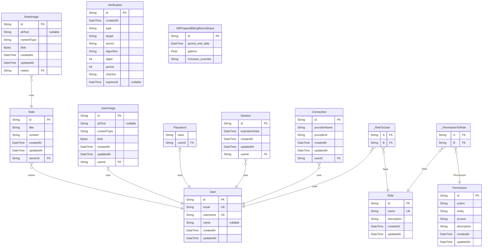

# Home Energy Analysis Tool

> Generated by [`prisma-markdown`](https://github.com/samchon/prisma-markdown)

- [default](#default)

## default

### `User`

**Properties**

- `id`:
- `email`:
- `username`:
- `name`:
- `createdAt`:
- `updatedAt`:

### `Note`

**Properties**

- `id`:
- `title`:
- `content`:
- `createdAt`:
- `updatedAt`:
- `ownerId`:

### `NoteImage`

**Properties**

- `id`:
- `altText`:
- `contentType`:
- `blob`:
- `createdAt`:
- `updatedAt`:
- `noteId`:

### `UserImage`

**Properties**

- `id`:
- `altText`:
- `contentType`:
- `blob`:
- `createdAt`:
- `updatedAt`:
- `userId`:

### `Password`

**Properties**

- `hash`:
- `userId`:

### `Session`

**Properties**

- `id`:
- `expirationDate`:
- `createdAt`:
- `updatedAt`:
- `userId`:

### `Permission`

**Properties**

- `id`:
- `action`:
- `entity`:
- `access`:
- `description`:
- `createdAt`:
- `updatedAt`:

### `Role`

**Properties**

- `id`:
- `name`:
- `description`:
- `createdAt`:
- `updatedAt`:

### `Verification`

**Properties**

- `id`:
- `createdAt`:
- `type`: The type of verification, e.g. "email" or "phone"
- `target`: The thing we're trying to verify, e.g. a user's email or phone
  number
- `secret`: The secret key used to generate the otp
- `algorithm`: The algorithm used to generate the otp
- `digits`: The number of digits in the otp
- `period`: The number of seconds the otp is valid for
- `charSet`: The valid characters for the otp
- `expiresAt`: When it's safe to delete this verification

### `Connection`

**Properties**

- `id`:
- `providerName`:
- `providerId`:
- `createdAt`:
- `updatedAt`:
- `userId`:

### `OilPropaneBillingRecordInput`

**Properties**

- `id`:
- `period_end_date`:
- `gallons`:
- `inclusion_override`:

### `_RoleToUser`

Pair relationship table between [Role](#Role) and [User](#User)

**Properties**

- `A`:
- `B`:

### `_PermissionToRole`

Pair relationship table between [Permission](#Permission) and [Role](#Role)

**Properties**

- `A`:
- `B`:
