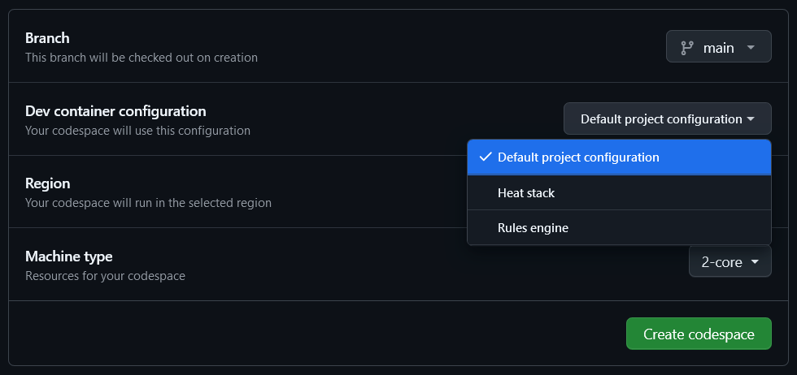

# Rules Engine
This is the workspace for the HEAT rules engine. 

For an outline of the logic behind the rules engine and a glossary of common terms, see the [Intro to Rules Engine wiki page](https://github.com/codeforboston/home-energy-analysis-tool/wiki/Intro-to-Rules-Engine).

## Development
Simple steps for development setup:

1. Clone the git repository.
2. Navigate to any directory and create a [virtual environment](https://docs.python.org/3/library/venv.html#creating-virtual-environments) and activate it
3. The following commands can be run from inside the rules-engine folder while the virtual environment is active
4. `pip install -e .` builds the [python egg](https://stackoverflow.com/questions/2051192/what-is-a-python-egg) for the rules engine and then installs the rules engine
5. `pip install -r requirements-dev.txt` which installs the required libraries

Then, you should be able to run `pytest`, also from any directory, and see tests run successfully.

## Codespaces
The default codespace does not have the version of Python pre-installed that is used to develop the rules engine.  You _can_ use it and update it to install the correct Python vsion, but this takes time.  

Instead, you can spin up a codespace with the correct version like so:

1. navigate to the green "code" dropdown
2. select the "codespaces" tab
3. select the "..." menu
4. select "new with options"
5. on the options screen, under "Dev container configuration", select "Rules engine"
6. click "Create codespace"

