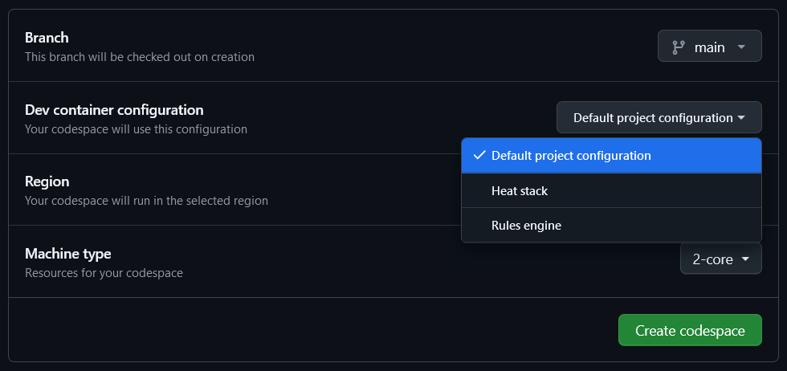

# Rules Engine

This is the workspace for the HEAT rules engine.

For an outline of the logic behind the rules engine and a glossary of common terms, see the [Intro to Rules Engine wiki page](https://github.com/codeforboston/home-energy-analysis-tool/wiki/Intro-to-Rules-Engine).

## Local Environment Setup
This project uses Python version 3.13.

1. Clone or fork the git repository, if not already done.
2. (Optional) Install `pre-commit`

- On MacOS: `brew install pre-commit`
- On Windows:
  - Open a Git Bash terminal
  - If you lack Homebrew,
    - Install Homebrew with `/bin/bash -c "$(curl -fsSL https://raw.githubusercontent.com/Homebrew/install/HEAD/install.sh)"`
    - Follow the steps that appear in the prompt following Homebrew installation
  - `brew install pre-commit`
3. Open Git Bash terminal.
4. Install `uv`

- On MacOS `brew install uv`
- On Windows, `pip install uv`

5. Navigate to project's python directory by typing `cd python`.
6. Run `uv sync --dev` to create the virtual environment and install all dependencies.
7. Run `uv run pytest` and see tests run successfully.
   Next steps: [README.md](https://github.com/codeforboston/home-energy-analysis-tool/blob/main/heat-stack/README.md)


## Development

Using a codespace for environment setup is highly recommended. Local environment setup can produce small build issues that can be hard to diagnose. If you prefer setting up locally without using a codespace, see [Appendix A](#appendix-a---local-environment-setup)

### Setup Codespace

If you are coding with another person, only one of you needs to do these steps.

1. From github, either open the main repo or a fork.
2. navigate to the green "code" dropdown
3. select the "codespaces" tab
4. select the "..." menu
5. select "new with options"
6. on the options screen, under "Dev container configuration", select "Rules engine"
7. click "Create codespace". This will open a web version of VSCode.



### Co-edit with LiveShare

If you are not coding with others and you want to use the web version of VSCode provided by the codespace, you can skip this step.

The owner of the codespace:

1. Install LiveShare extenion.
2. Open LiveShare extension.
3. Start a new session. This will copy a LiveShare link into your clipboard.
4. Open a new terminal.

### Open Editor

1. Open the link created for the LiveShare session.
2. When prompted, open in local VSCode or with Codespace on the web.

### Open Terminal

1. To create a new terminal, select the `Terminal => New` menu option.
2. To open an existing terminal, select the terminal in the terminal pane.
3. If you did not create the terminal, you will see a message to press Enter. This creates a request for the terminal owner to give you read/write access.
4. When the terminal owner gives you access, you will see an alert to press any key to focus the terminal. Press the alert.

### Modifying Code for an Issue

1. Find an issue to work on
2. Open a bash terminal
3. Create a branch from main. Best practice for naming looks like this: <feature/fix/chore>/<issue number>/<description>. Separate words in the description using a dash (-). Consider using the subject as a description. Example:

```
git checkout main
git switch -c feature/341/validate-address
```

4. Commit each time you make progress. This lets you:

- Lose less work when you roll back after a mistake (we all make them)
- Review smaller changes and allow your team to do the same during their review
- Protect new changes from misfortune, like a crash
- Track progress for yourself and your team

### Reverting commits

If you have already made a pull request, avoid reverting if at all possible. If you must revert a commit, consult with the team first.

To revert a commmit:

- `git reset <--soft/--mixed/--hard> HEAD~1` if you want to go to the previous commit.
- `git reset <--soft/--mixed/--hard> HEAD~2` If you want to revert 2 commits.
- `git reset <--soft/--mixed/--hard> HEAD~N` If you want to revert N commits.

Use `--soft` if you want the committed changes to be staged.  This flag is handy if you have unstaged changes you don't want to mix them with.
Use `--mixed` if you want the committed changes to be unstaged.  This flag is handy if you have staged changes you don't want to mix them with.
Use `--hard` if you want the committed changes gone immediately.  This flag causes irreversible data loss.

If you have already pushed your branch to GitHub, you have two choices depending on what else you have already done.

1. If you have opened a pull request, then do a force push via `git push origin <branch_name> --force-with-lease`
2. If you have not, then delete the branch on GitHub and push your local branch up again.


### Adding Python Packages

Check with a development lead before adding a python package. Adding python packages to development can be useful for syntax checking, testing, and building purposes, but should be avoided for production `src` code. Incorporating new packages into rules-engine.whl, which is used by the front end, is complicated. To add a package to development:

1. Add package to the `project.optional-dependencies` section of pyproject.toml
2. Run `uv sync --dev` to lock dependencies and update your environment.

### Pre-Commit Verification

Before committing your changes, navigate to the `python` directory and run the complete verification script:

```bash
source prepare.sh
```

This script:
1. **Formats code** with Black
2. **Type-checks** with mypy
3. **Sorts imports** with isort
4. **Runs tests** with pytest
5. **Builds the wheel** to verify packaging integrity

The wheel build is critical because the rules engine is used by Pyodide (WebAssembly). This step ensures that:
- All data files (`.csv`) are correctly included
- Module structure is correct
- The packaged wheel matches what will be deployed

If `prepare.sh` succeeds without errors, your changes are ready to commit and push.

### Committing Your Changes

Run the pre-commit verification script (see [Pre-Commit Verification](#pre-commit-verification)) before committing your changes.

### Creating a Pull Request

1. Rebase from main if not done recently.

<details open>
<summary>Protect your progress</summary>
Rebasing can have unexpected effects. We recommend you either push your code before rebasing or do a dry run:

```git
git checkout <rebase test branch name>
git checkout main
git pull origin main
git checkout <rebase test branch name>
git rebase main
```

If you have trouble, talk to the team. If not continue to the usual instructions.
</details>

```
git checkout main
git pull origin main
git checkout <your branch>
git rebase main
```

2. Push your branch either to a fork of the repository or to the main repo (if you have privileges): `git push origin <branch_name>`.
3. Create a pull request from github.
   - Include statement "Closes `#<issue number>`" if your changes completely fix or address the issue.
   - Check that all checks pass in the pull request.
4. Review file changes.
5. Include a brief description of the changes you made to each file.
6. Request reviewers.
